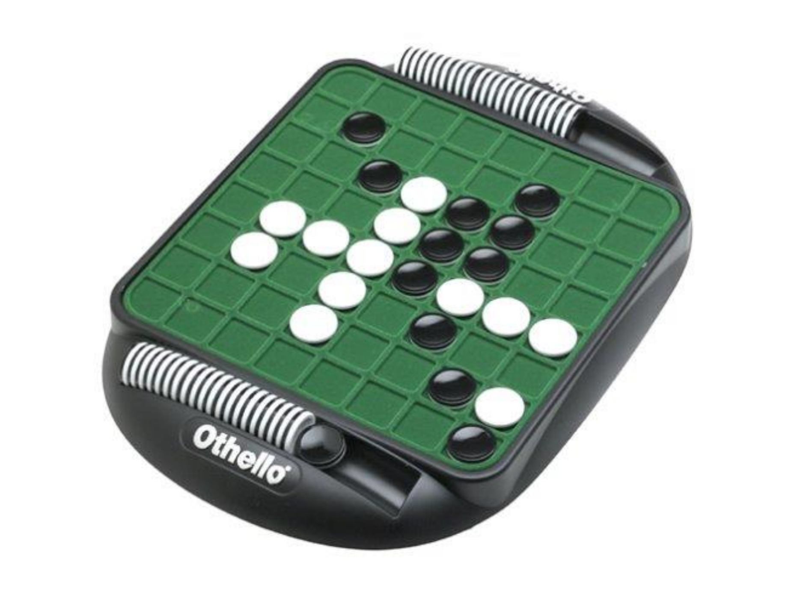

# Othello!

A single large project completed in three stages and therefore counts as three projects. This project we will be implementing a game of **OTHELLO**, with the final product being a game that can play an intelligent game of **OTHELLO** against a human opponent.

This game is derived from the author's game class. The files are `game.h` and `game.cc`. Also included is a file called `colors.h` which was created by a former student who has given us permission to use it. It allows you to adjust the colors of the screen during a text-based console or ssh session. The *play* function in the game class has been altered, by commenting out some of the code, so that it will work for the first phase of the project. By the end we will have returned to the original author’s game class with only a couple of little alterations.

The game class creates a map for us in how the project is developed, and at the end we will find that most of the “AI” has already been written for us in this parent class. If you look at `game.h`, you will see that there are virtual functions that “must be overridden” and some that “may optionally be overridden" (eventually a child version for all the mandatory overrides will be written).

The rules of this game appear on a separate sheet. Basically, the game consists of two-sided playing pieces and the goal is to out-flank your opponent which allows you to "capture" his pieces by flipping them over to your color. Pieces are outflanked when you position a piece in such a way that one or more of your opponent's pieces in a row are between two of your pieces. Every move consists of putting a single piece onto the board. The pieces are never moved from their original location, and the game continues until there are no more moves available to either player. At that time, the player with the most pieces showing his or her color wins.

### Stage 1

The first stage is the **design stage**. In this part representation of the pieces and how the board is displayed is decided (with pecial attention given to the quality of the design, the attractiveness of the board, and the ease of the user interface). This first stage is *derived from the game class*. A child class for `Othello` was created that is responsible for storing the board. The board is a two-dimensional array of spaces, pieces, or pointers to spaces or pieces, where the *spaces are another class* which has been written. This board becomes the principle private member of the `Othello` class. The spaces class is able to store all the attributes that a space (or piece) might have – emptiness, black, white, as well as mutators and accessor functions to transform a piece/space from one state to another.

The design was then implemented to the stage where the user can see the board displayed and be allowed to make one initial move. The first step in doing this was to write the space/piece class, which was **not** derived from anything, but can change states. Then, when writing the `Othello` class, which is derived from the author’s game class, the best first step, after declaring the board, **is to create stubs for all the author’s purely virtual functions** (a stub is a function with an empty implementation, which exists merely to validate a call, or to allow the program to compile). For this stage the following functions were implemented: `display_status`, `make_move`, and `is_legal` which returns true if the move is any of the four allowable initial moves.

### Stage 2

In the second stage a two-player game which allows two humans to play the game against each other on the computer is implemented. All rules are enforced. This stage involves a much more extensive `is_legal` function, since now that function must embody all the rules of the game.

### Stage 3

In the final stage the computer plays an "intelligent" game against a human opponent. Again, all rules are enforced, and the computer should not cheat. This is frequently called the "AI" stage of the game, where much of the AI work is done by the author's game class.
